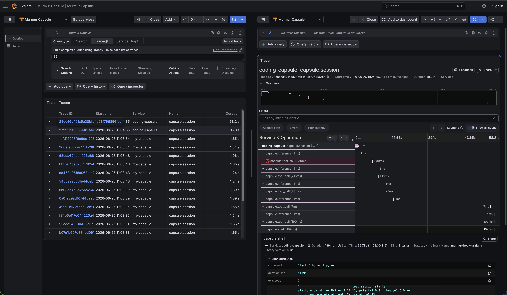
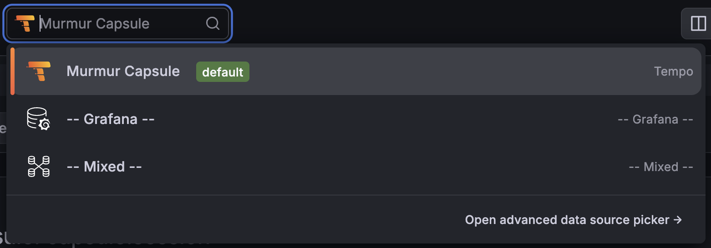
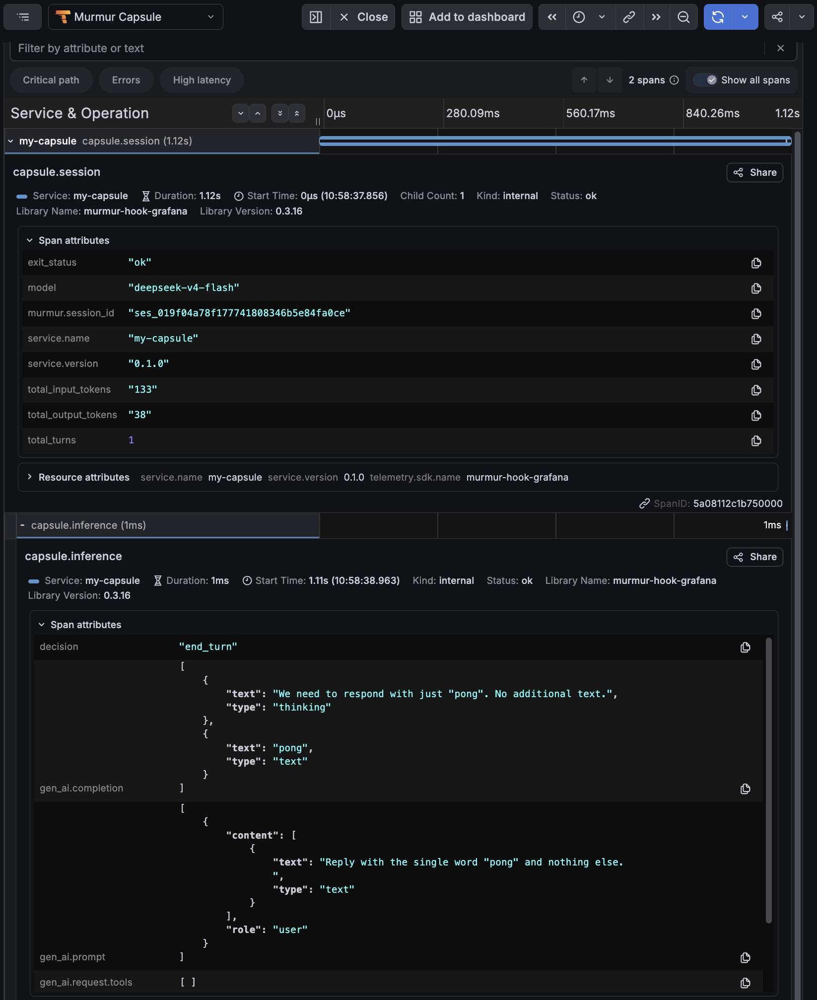

# How to work with capsule trace spans in Grafana



Every Murmur session emits an OpenTelemetry trace when `observability.otel_endpoint` is set in the manifest. The trace contains a root `capsule.session` span covering the full session lifecycle, with nested child spans for each inference turn, tool call, and shell command. This guide walks through routing those spans to a Grafana Tempo backend and using Grafana's Explore view to inspect timing and attributes for individual sessions.

This is distinct from `mur trace show`, which reads the local `trace.jsonl` file without requiring an external backend.

The relevant manifest options are:

| Option | Controls |
|---|---|
| [observability.otel_endpoint](../reference/manifest-schema.md#field-observability) | OTLP/HTTP endpoint where the runtime posts spans at session end |

---

## Step 1 — start Tempo and Grafana

The runtime writes spans over OTLP/HTTP to port **4318**. Tempo stores and serves traces over HTTP on port **3200**. Grafana reads from Tempo and listens on port **3000**.

Create a `tempo.yaml` configuration file:

```yaml
server:
  http_listen_port: 3200

ingester:
  max_block_duration: 1m

distributor:
  receivers:
    otlp:
      protocols:
        http:
          endpoint: "0.0.0.0:4318"

storage:
  trace:
    backend: local
    wal:
      path: /var/tempo/wal
    local:
      path: /var/tempo/traces
```

`ingester.max_block_duration: 1m` cuts WAL blocks every minute. Without it, spans are not queryable for up to 30 minutes after a session ends.

Create a `docker-compose.yaml` file in the same directory as `tempo.yaml`:

```yaml
services:
  tempo:
    image: grafana/tempo:2.9.0
    command: ["-config.file=/etc/tempo.yaml"]
    volumes:
      - ./tempo.yaml:/etc/tempo.yaml
    ports:
      - "4318:4318"
      - "3200:3200"

  grafana:
    image: grafana/grafana:13.1.0
    ports:
      - "3000:3000"
    environment:
      - GF_AUTH_ANONYMOUS_ENABLED=true
      - GF_AUTH_ANONYMOUS_ORG_ROLE=Admin
    volumes:
      - ./grafana-datasources.yaml:/etc/grafana/provisioning/datasources/tempo.yaml
```

`GF_AUTH_ANONYMOUS_ENABLED` and `GF_AUTH_ANONYMOUS_ORG_ROLE=Admin` grant full admin access without a login prompt — only use this for local development.

The `grafana-datasources.yaml` mount provisions the Tempo data source on startup, so Explore opens with it pre-selected. Provisioning recreates the data source every time the container starts and survives `docker compose down`; a data source added through the UI lives in Grafana's internal database and is lost whenever the container is recreated.

Create a `grafana-datasources.yaml` file in the same directory:

```yaml
apiVersion: 1
datasources:
  - name: Murmur Capsule
    type: tempo
    uid: murmur-capsule-tempo
    url: http://tempo:3200
    access: proxy
    isDefault: true
```

The URL uses the Tempo service name `tempo` (not `localhost`): Grafana reaches Tempo over the Compose network, where the host is the service name from `docker-compose.yaml`.

!!! warning "Pin Tempo to 2.9.0 — do not use 2.10+"
    Tempo `2.10+` has a regression that breaks TraceQL search on the local
    storage backend: spans are ingested and retrievable by trace ID, but
    queries such as `{name="capsule.session"}` return zero results. Versions
    up to and including `2.9.0` work correctly. If your search results are
    always empty, check the running image with `docker compose ps` and pin
    `grafana/tempo:2.9.0`.

Start both services:

```bash
docker compose up -d
```

Confirm Tempo is ready:

```bash
curl -s http://localhost:3200/ready
```

The response is the string `ready`.

---

## Step 2 — configure the manifest

Create a `murmur.yaml` file with `observability.otel_endpoint` pointing to Tempo's OTLP ingest port. The `murmur-hook-grafana` artifact adds a hook-side enriched span tree on top of the native emission path — both are independent and a failure in one does not suppress the other:

=== "Anthropic"

    ```yaml
    name: my-capsule
    version: "0.1.0"

    artifacts:
      - name: murmur-driver-anthropic
        version: "{{ v.murmur_driver_anthropic }}"
        runtime: driver
      - name: murmur-hook-grafana
        version: "{{ v.murmur_hook_grafana }}"
        runtime: hook
        capabilities:
          network:
            allow:
              - http://localhost:4318

    capabilities:
      network:
        allow:
          - https://api.anthropic.com

    inference:
      transport: http
      endpoint: https://api.anthropic.com
      model: {{ v.model_anthropic }}
      api_key: ${ANTHROPIC_API_KEY}
      driver:
        artifact: murmur-driver-anthropic

    observability:
      otel_endpoint: http://localhost:4318
    ```

=== "OpenAI"

    ```yaml
    name: my-capsule
    version: "0.1.0"

    artifacts:
      - name: murmur-driver-openai
        version: "{{ v.murmur_driver_openai }}"
        runtime: driver
      - name: murmur-hook-grafana
        version: "{{ v.murmur_hook_grafana }}"
        runtime: hook
        capabilities:
          network:
            allow:
              - http://localhost:4318

    capabilities:
      network:
        allow:
          - https://api.openai.com

    inference:
      transport: http
      endpoint: https://api.openai.com
      model: {{ v.model_openai }}
      api_key: ${OPENAI_API_KEY}
      driver:
        artifact: murmur-driver-openai

    observability:
      otel_endpoint: http://localhost:4318
    ```

=== "DeepSeek"

    ```yaml
    name: my-capsule
    version: "0.1.0"

    artifacts:
      - name: murmur-driver-deepseek
        version: "{{ v.murmur_driver_deepseek }}"
        runtime: driver
      - name: murmur-hook-grafana
        version: "{{ v.murmur_hook_grafana }}"
        runtime: hook
        capabilities:
          network:
            allow:
              - http://localhost:4318

    capabilities:
      network:
        allow:
          - https://api.deepseek.com

    inference:
      transport: http
      endpoint: https://api.deepseek.com
      model: {{ v.model_deepseek }}
      api_key: ${DEEPSEEK_API_KEY}
      driver:
        artifact: murmur-driver-deepseek

    observability:
      otel_endpoint: http://localhost:4318
    ```

---

## Step 3 — install dependencies

```bash
mur install
```

--8<-- "includes/mur-pull-info.md"

---

## Step 4 — run the capsule

Create a `task.md` file:

```text
Reply with the single word "pong" and nothing else.
```

Run the capsule:

```bash
mur run --task task.md
```

```
murmur: url localhost:52222
session: ses_019ed2af53da75c2aefee84ee10c34af
status:  ok
```

The runtime posts the span tree to Tempo at session end. Wait about 60–90 seconds for Tempo to flush its WAL to a searchable block.

Confirm the trace is indexed:

```bash
curl -s 'http://localhost:3200/api/search?q=%7Bname%3D%22capsule.session%22%7D' \
  | jq '.traces | length'
```

The result should be `1`. If it is `0`, wait another 30 seconds and retry.

---

## Step 5 — explore spans

Navigate to **Explore** in the left sidebar. Open the data source picker at the top and select **Tempo** — the source provisioned in Step 1, marked `default`. Grafana does not always pre-select it, so confirm **Tempo** is chosen before querying.



Switch the query mode to **TraceQL** and enter:

```
{resource.service.name="my-capsule"}
```

Click **Run query**. The results panel lists one row per session. Click a trace ID to open the span tree.



Click the trace link in the **Table - Traces** panel to open the trace detail, as shown above.

Key attributes on the `capsule.session` root span:

| Attribute | Value |
|---|---|
| `service.name` | Capsule name from `murmur.yaml` |
| `service.version` | Capsule version from `murmur.yaml` |
| `model` | Model identifier used for inference |
| `exit_status` | `ok`, `failed`, `max_turns_reached`, etc. |
| `murmur.session_id` | Session UUID — matches the `workdir` folder name |

Key attributes on `capsule.inference` child spans:

| Attribute | Value |
|---|---|
| `turn` | Turn number (0-indexed) |
| `input_tokens` | Tokens in the inference request |
| `output_tokens` | Tokens in the model's response |
| `decision` | What the model decided: `tool_call` or `end_turn` |
| `tool_name` | Name of the tool called (when `decision` is `tool_call`) |

To filter to sessions that exited cleanly:

```
{resource.service.name="my-capsule" && .exit_status="ok"}
```

To find all sessions that made at least one tool call:

```
{resource.service.name="my-capsule"} >> {name="capsule.tool_call"}
```

---

Once spans are flowing into Tempo, the topology view can query the same backend to reconstruct which capsule called which — it reads `capsule.session` spans, follows their parent–child relationships, and renders an interactive graph in the browser where each node is a session and each edge is an A2A delegation.

---

## Summary

| What to do | How |
|---|---|
| Emit spans | Set `observability.otel_endpoint: http://localhost:4318` in `murmur.yaml` |
| Enrich spans with hook-side data | Declare `murmur-hook-grafana` as a `runtime: hook` artifact, and grant it the collector host via the entry's own `capabilities.network.allow` — hooks have no network by default (see [Hook capabilities](../reference/manifest-schema.md#hook-capabilities)) |
| Confirm spans arrived | `curl .../api/search?q=...` returns `traces.length > 0` |
| Find sessions in Grafana | Explore → Tempo → TraceQL `{resource.service.name="my-capsule"}` |
| Inspect a session | Click a trace ID → flame graph → span detail panel |
| Filter by exit status | `{resource.service.name="my-capsule" && .exit_status="ok"}` |
