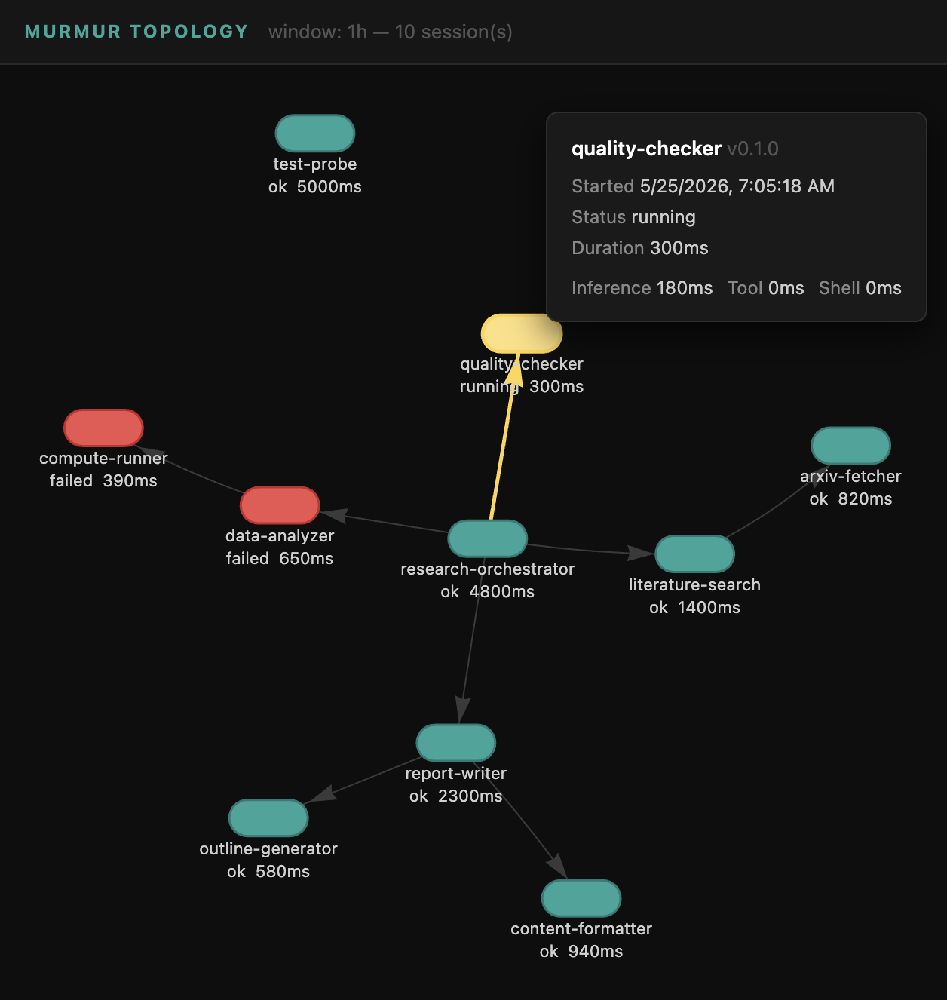

# How to visualise capsule sessions with mur topology

!!! warning "Beta feature"

    `mur topology` is a beta feature and is hidden by default. Enable it first with
    `mur beta enable topology`. It also requires a running OpenTelemetry trace
    backend (e.g. Grafana Tempo) to query for spans — see Step 1 below. Behavior
    and flags may change in future releases.

`mur topology` queries a Grafana Tempo backend for `capsule.session` spans, reconstructs which capsule called which, and renders an interactive graph in the browser. Each node represents one session — colour-coded by exit status — and directed edges follow A2A delegation paths. This guide walks through starting Tempo, generating real span data from capsule runs, and confirming the graph renders correctly for both single-capsule and multi-capsule scenarios.

Reach for this when you need to answer questions like:

- **Did my A2A call actually fire?** If you expected capsule A → B but only one node appears, the delegation never happened.
- **Which session failed?** Red nodes stand out immediately — hover for the exit status and per-span timing without digging through logs.
- **Where did time go?** The tooltip breaks down inference, tool, and shell milliseconds per session so you can see which capsule in a chain is the bottleneck.



The relevant manifest options are:

| Option | Controls |
|---|---|
| [observability.otel_endpoint](../reference/manifest.md#field-observability) | OTLP/HTTP endpoint where the runtime posts spans at session end |

---

## Step 1 — start Grafana Tempo

`mur topology` reads from the Tempo HTTP query API on port **3200**. The capsule runtime writes spans to the OTLP ingest port on **4318**. Both ports must be reachable.

Create a `tempo.yaml` configuration file in the directory you will run Tempo from:

```yaml
server:
  http_listen_port: 3200

ingester:
  max_block_duration: 1m

distributor:
  receivers:
    otlp:
      protocols:
        http:
          endpoint: 0.0.0.0:4318

storage:
  trace:
    backend: local
    local:
      path: /tmp/tempo/traces
    wal:
      path: /tmp/tempo/wal
```

One setting matters for this guide:

- `ingester.max_block_duration: 1m` — Tempo's default is 30 minutes. This cuts WAL blocks every minute so spans are flushed to searchable backend blocks quickly. Without it you wait up to 30 minutes before `mur topology` finds any sessions.

Start Tempo on your machine with Docker, from the same directory as `tempo.yaml`:

```bash
docker run -d --name tempo \
  -p 4318:4318 -p 3200:3200 \
  -v $(pwd)/tempo.yaml:/etc/tempo.yaml \
  grafana/tempo:2.6.1 \
  -config.file=/etc/tempo.yaml
```

Confirm it is ready:

```bash
curl -s http://localhost:3200/ready
```

The response is the string `ready`.

!!! note "Tempo version"
    Pin to a specific tag such as `2.6.1` rather than `latest`, which can resolve to a release candidate.

---

## Step 2 — configure a capsule to emit spans

Create a `murmur.yaml` with `observability.otel_endpoint` pointing to the OTLP ingest port:

=== "Anthropic"

    ```yaml
    name: ping-capsule
    version: "0.1.0"

    artifacts:
      - name: murmur-driver-anthropic
        version: "{{ v.murmur_driver_anthropic }}"
        runtime: driver

    capabilities:
      network:
        allow:
          - https://api.anthropic.com

    inference:
      transport: http
      endpoint: https://api.anthropic.com
      model: {{ v.model_anthropic }}
      api_key: ${ANTHROPIC_API_KEY}
      driver:
        artifact: murmur-driver-anthropic

    observability:
      otel_endpoint: http://localhost:4318
    ```

=== "OpenAI"

    ```yaml
    name: ping-capsule
    version: "0.1.0"

    artifacts:
      - name: murmur-driver-openai
        version: "{{ v.murmur_driver_openai }}"
        runtime: driver

    capabilities:
      network:
        allow:
          - https://api.openai.com

    inference:
      transport: http
      endpoint: https://api.openai.com
      model: {{ v.model_openai }}
      api_key: ${OPENAI_API_KEY}
      driver:
        artifact: murmur-driver-openai

    observability:
      otel_endpoint: http://localhost:4318
    ```

=== "DeepSeek"

    ```yaml
    name: ping-capsule
    version: "0.1.0"

    artifacts:
      - name: murmur-driver-deepseek
        version: "{{ v.murmur_driver_deepseek }}"
        runtime: driver

    capabilities:
      network:
        allow:
          - https://api.deepseek.com

    inference:
      transport: http
      endpoint: https://api.deepseek.com
      model: {{ v.model_deepseek }}
      api_key: ${DEEPSEEK_API_KEY}
      driver:
        artifact: murmur-driver-deepseek

    observability:
      otel_endpoint: http://localhost:4318
    ```

Create a `task.md` input file:

```text
Reply with the single word "pong" and nothing else.
```

---

## Step 3 — run the capsule and confirm the span arrives

```bash
mur run --manifest murmur.yaml --input task.md
```

The capsule runs one inference turn and exits. The runtime emits a `capsule.session` span to Tempo immediately at session end.

Wait about 60–90 seconds for Tempo to flush its WAL to a searchable block, then confirm the trace is indexed:

```bash
curl -s 'http://localhost:3200/api/search?q=%7B+name+%3D+%22capsule.session%22+%7D' \
  | jq '.traces | length'
```

The result should be `1`. If it is `0`, wait another 30 seconds and retry. Tempo's default search window is 15 minutes, so run this query within that window after the capsule exits.

---

## Step 4 — open the topology view

Write the HTML to a file so it is easy to inspect:

```bash
mur topology --otel-endpoint http://localhost:3200 --output /tmp/topology.html
```

Output:

```text
murmur: topology written to /tmp/topology.html
```

Open `/tmp/topology.html` in your default browser:

```bash
open /tmp/topology.html
```

The page shows:

- A single **green node** labelled `ping-capsule` with its duration in milliseconds
- The subheading `Time window: 1h — 1 session(s)` below the page title
- A directed graph rendered by vis.js — drag nodes to rearrange; scroll to zoom

Hover over the node to see the tooltip: capsule name and version, exit status, total duration, and per-span timing (inference ms, tool call ms, shell ms).

To open the graph directly in the browser without an intermediate file path:

```bash
mur topology --otel-endpoint http://localhost:3200
```

The command writes a temp file to `/tmp/murmur-topology-<timestamp>.html` and opens it immediately.

To see only the most recent session, narrow the window (default is 1h) — for example `--window 5m`. To get a fully clean slate, restart Tempo (which clears its WAL and local storage).

```bash
mur topology --otel-endpoint http://localhost:3200 --window 5m
```

---

## Step 5 — add a worker capsule (two-node scenario)

This step starts a second capsule, sends it a task that carries a W3C `traceparent` header linking it to the `ping-capsule` session from Step 3, and confirms the topology view renders a directed edge between them.

The runtime injects the `traceparent` header automatically on every `murmur:message/send` call. In this step we construct the header manually from ping-capsule's span so you can see the full chain without needing a second orchestrator capsule.

**Look up ping-capsule's trace and session span from Tempo** (uses the span emitted in Step 3):

```bash
PING_TRACE=$(curl -s "http://localhost:3200/api/search?q=%7B+name+%3D+%22capsule.session%22+%26%26+resource.service.name+%3D+%22ping-capsule%22+%7D&limit=10&start=$(($(date +%s)-3600))&end=$(date +%s)" \
  | jq -r '[.traces[]] | sort_by(.startTimeUnixNano) | reverse | .[0].traceID')
PING_TRACE=$(printf '%032s' "$PING_TRACE" | tr ' ' '0')
PING_SPAN_B64=$(curl -s "http://localhost:3200/api/traces/${PING_TRACE}" | jq -r '[.batches[].scopeSpans[].spans[] | select(.name=="capsule.session")][0].spanId')
PING_SPAN=$(python3 -c "import base64; print(base64.b64decode('${PING_SPAN_B64}').hex())")
echo "trace: $PING_TRACE  span: $PING_SPAN"
```

The query filters by `service.name = "ping-capsule"` — **replace `ping-capsule` in the URL-encoded query with the `name:` value from your manifest if you chose a different name**. Fetching 10 results and sorting by `startTimeUnixNano` ensures the most recent ping-capsule session is always selected, even if there are older runs still in Tempo's index. `PING_SPAN` will be a 16-char hex string — Tempo's `/api/traces` returns `spanId` as base64 (proto3 JSON encoding for bytes) so the `python3` step converts it.

Create `worker/murmur.yaml`:

=== "Anthropic"

    ```yaml
    name: echo-worker
    version: "0.1.0"

    artifacts:
      - name: murmur-driver-anthropic
        version: "{{ v.murmur_driver_anthropic }}"
        runtime: driver

    capabilities:
      network:
        allow:
          - https://api.anthropic.com

    inference:
      transport: http
      endpoint: https://api.anthropic.com
      model: {{ v.model_anthropic }}
      api_key: ${ANTHROPIC_API_KEY}
      driver:
        artifact: murmur-driver-anthropic

    observability:
      otel_endpoint: http://localhost:4318

    lifecycle:
      task_acceptance: queue
      after_task: sleep
    ```

=== "OpenAI"

    ```yaml
    name: echo-worker
    version: "0.1.0"

    artifacts:
      - name: murmur-driver-openai
        version: "{{ v.murmur_driver_openai }}"
        runtime: driver

    capabilities:
      network:
        allow:
          - https://api.openai.com

    inference:
      transport: http
      endpoint: https://api.openai.com
      model: {{ v.model_openai }}
      api_key: ${OPENAI_API_KEY}
      driver:
        artifact: murmur-driver-openai

    observability:
      otel_endpoint: http://localhost:4318

    lifecycle:
      task_acceptance: queue
      after_task: sleep
    ```

=== "DeepSeek"

    ```yaml
    name: echo-worker
    version: "0.1.0"

    artifacts:
      - name: murmur-driver-deepseek
        version: "{{ v.murmur_driver_deepseek }}"
        runtime: driver

    capabilities:
      network:
        allow:
          - https://api.deepseek.com

    inference:
      transport: http
      endpoint: https://api.deepseek.com
      model: {{ v.model_deepseek }}
      api_key: ${DEEPSEEK_API_KEY}
      driver:
        artifact: murmur-driver-deepseek

    observability:
      otel_endpoint: http://localhost:4318

    lifecycle:
      task_acceptance: queue
      after_task: sleep
    ```

Start the worker in the background and capture its URL:

```bash
mur run --manifest worker/murmur.yaml > worker.log 2>&1 &
sleep 2
WORKER_URL=$(grep 'murmur: url' worker.log | awk '{print $3}')
echo "Worker: $WORKER_URL"
```

Send the worker a task with the traceparent header and capture the task ID:

```bash
TASK_ID=$(curl -s -X POST "http://${WORKER_URL}" \
  -H "Content-Type: application/json" \
  -H "traceparent: 00-${PING_TRACE}-${PING_SPAN}-01" \
  -d '{
    "jsonrpc": "2.0",
    "id": 1,
    "method": "message/send",
    "params": {
      "message": {
        "messageId": "msg-001",
        "contextId": "ctx-001",
        "role": "user",
        "parts": [{"text": "Reply with the single word pong."}]
      }
    }
  }' | jq -r '.result.id')
echo "Task: $TASK_ID"
```

Poll `tasks/get` until the session completes:

```bash
while true; do
  STATE=$(curl -s -X POST "http://${WORKER_URL}" \
    -H "Content-Type: application/json" \
    -d "{\"jsonrpc\":\"2.0\",\"id\":2,\"method\":\"tasks/get\",\"params\":{\"id\":\"${TASK_ID}\"}}" \
    | jq -r '.result.status.state')
  echo "State: $STATE"
  [ "$STATE" = "completed" ] || [ "$STATE" = "failed" ] && break
  sleep 2
done
```

Stop the worker:

```bash
kill %1
```

Wait 60–90 seconds for Tempo to flush the new span, then run the topology view using the default 1h window so both ping-capsule and echo-worker are included:

```bash
mur topology --otel-endpoint http://localhost:3200 --output /tmp/topology-two.html
```

Open `/tmp/topology-two.html`. The page shows two green nodes — `ping-capsule` and `echo-worker` — connected by a directed edge. The subheading reads `2 session(s)`. Inspect `window.TOPOLOGY_DATA` in the page source to confirm two entries in `"nodes"` and one entry in `"edges"`:

```json
{
  "edges": [{ "from": "<ping-capsule-traceID>", "to": "<echo-worker-traceID>", "weight": 1 }]
}
```

The topology builder resolves the edge by looking up `PING_SPAN` across all spans indexed from Tempo. It finds that span belongs to ping-capsule's trace, and since echo-worker's session span records it as `parentSpanId`, a directed edge is drawn from ping-capsule to echo-worker.

---

## Step 6 — inspect the embedded graph data

Every generated HTML page embeds the full graph data as a JavaScript object. To extract it for scripting or debugging:

```bash
grep -o 'window\.TOPOLOGY_DATA = {.*}' /tmp/topology-two.html \
  | sed 's/window\.TOPOLOGY_DATA = //' \
  | jq .
```

The output shape:

```json
{
  "nodes": [
    {
      "id": "<traceID>",
      "capsule_name": "ping-capsule",
      "capsule_version": "0.1.0",
      "exit_status": "ok",
      "start_time_ms": 1700000000000,
      "duration_ms": 823,
      "inference_ms": 601,
      "tool_ms": 0,
      "shell_ms": 0
    }
  ],
  "edges": []
}
```

Node colors map directly from `exit_status`:

| exit_status | Color |
|---|---|
| `ok` or `completed` | Green (`#4caf50`) |
| `failed` | Red (`#f44336`) |
| `running` | Yellow (`#ffeb3b`) |
| anything else | Orange (`#ff9800`) |

---

## Summary

| What to verify | How to check |
|---|---|
| Spans reach Tempo | `curl .../api/search?q=...` returns `traces.length > 0` |
| Single node appears | HTML contains the capsule name; node is green for `ok` exits |
| Two-node scenario | Both capsule names in `window.TOPOLOGY_DATA.nodes`; one entry in `window.TOPOLOGY_DATA.edges` |
| Inspect raw data | `grep window.TOPOLOGY_DATA` in the HTML, pipe through `jq` |
